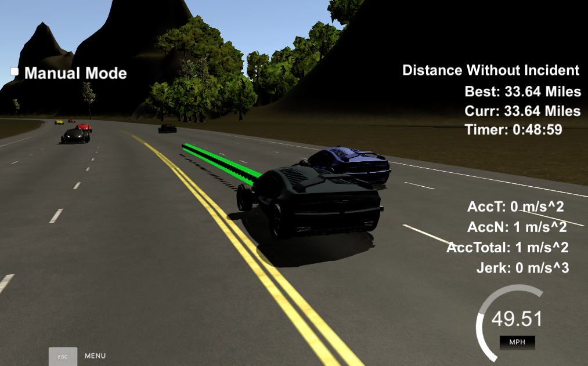

# CarND-Path-Planning-Project-P1
Udacity Self-Driving Car Nanodegree - Path Planning Project

# Goal

The goal of this project is to create a path planner that is able to smartly, safely, and comfortably navigate a virtual car (Ego) around a virtual highway with other traffic. 
We are given a map of the highway, as well as sensor fusion and localization data about our car and nearby cars. We are supposed to give back a set of map points (x, y) that a perfect controller will execute every 0.02 seconds. Navigating safely and comfortably means we don't bump into other cars, we don't exceed the maximum speed, acceleration and jerk requirements. Navigating smartly means we change lanes when we have to.

We need to implement a path planning algorithms to drive a car on a highway on a simulator provided by Udacity ([the simulator could be downloaded here](https://github.com/udacity/self-driving-car-sim/releases/tag/T3_v1.2)). The simulator sends car telemetry information (car's position and velocity) and sensor fusion information about the rest of the cars in the highway (Ex. car id, velocity, position). It expects a set of points spaced in time at 0.02 seconds representing the car's trajectory. The communication between the simulator and the path planner is done using WebSocket. The path planner uses the [WebSocket](https://en.wikipedia.org/wiki/WebSocket) WebSocket implementation to handle this communication.

The original project repository by Udacity you can find ([here](https://github.com/udacity/CarND-Path-Planning-Project)). It provides more information for this project.

# Prerequisites

The project has the following dependencies (from Udacity's seed project):

- cmake >= 3.5
- make >= 4.1
- gcc/g++ >= 5.4
- libuv 1.12.0
- Udacity's simulator.

For instructions on how to install these components on different operating systems, please, visit [Udacity's seed project](https://github.com/udacity/CarND-Path-Planning-Project). As this particular implementation was done on Mac OS, the rest of this documentation will be focused on Mac OS. I am sorry to be that restrictive.

In order to install the necessary libraries, use the [install-mac.sh](./install-mac.sh).

# Compiling and executing the project

I did this project in the workspace provided by Udacity. The source code include three files:  main.cpp,  spline.h & json.hpp. 
The process of compiling and executing the project is as follows:

- Navigate to project ‘CarND-Path-Planning-Project’
- Make a build directory in this directory `mkdir build && cd build`
- Compile: `cmake .. && make`
- Run it: `./path_planning.`
- Open the aforementioned simulator
- Choose the lowest resolution and graphics quality of fastest for best results
- Click the path planning SELECT

Now the path planner is running and listening on port 4567 for messages from the simulator. Next step is to open Udacity's simulator:

# [Rubic](https://review.udacity.com/#!/rubrics/1020/view) points

## Compilation

### The code compiles correctly.

- Configuring done
- Generating done
- Build files have been written to: /home/workspace/CarND-Path-Planning-Project/build
- Scanning dependencies of target path_planning
- [ 50%] Building CXX object CMakeFiles/path_planning.dir/src/main.cpp.o
- [100%] Linking CXX executable path_planning
- [100%] Built target path_planning
- root@45a506d03cee:/home/workspace/CarND-Path-Planning-Project/build# ./path_planning
- Listening to port 4567

## Valid trajectories

### The car is able to drive at least 4.32 miles without incident.
I ran the simulator for 15 and 20 miles without incidents:

### The car drives according to the speed limit.
The speed limit is 50 MPH, no speed limit red message was seen.

### Max Acceleration and Jerk are not Exceeded.
Max jerk red message was not seen.

### Car does not have collisions.
No collisions.

### The car stays in its lane, except for the time between changing lanes.
The car stays in its lane most of the time but when it changes lane because of traffic or to return to the center lane.

### The car is able to change lanes
The car change lanes when the there is a slow car in front of it, and it is safe to change lanes (no other cars around) or when it is safe to return the center lane.

## Reflection

The path planning algorithms start at [src/main.cpp](./src/main.cpp#L250) line 250 to the line 465. The code model of the generation path is described in detail below：

The code consist of three parts:

### Prediction [line 250 to line 313](./src/main.cpp#L250)
This part of the code deal with the telemetry and sensor fusion data. It intents to reason about the environment. In the case, we want to know four aspects of it:

- Identify conditions in which lane the cars around Ego were in.
- Is there a car in front of us blocking the traffic?
- Is there a gap to the right of us for making a lane change?
- Is there a gap to the left of us making a lane change not safe?

These questions are answered by calculating the lane each other car is and the position it will be at the end of the last plan trajectory. A car is considered "dangerous" when its distance to our car is less than 30 meters in front or behind us.

### Behavior [line 314 to line 343](./src/main.cpp#L314)
This part decides what to do:
  - If we have a car in front of us, do we change lanes?
  - Do we speed up or slow down?

Based on the prediction of the situation we are in, this code increases the speed, decrease speed, or make a lane change when it is safe. Instead of increasing the speed at this part of the code, a `speed_diff` is created to be used for speed changes when generating the trajectory in the last part of the code. This approach makes the car more responsive acting faster to changing situations like a car in front of it trying to apply breaks to cause a collision.

### Trajectory [line 344 to line 465](./src/main.cpp#L344)
This code does the calculation of the trajectory based on the speed and lane output from the behavior, car coordinates and past path points.

First, the last two points of the previous trajectory (or the car position if there are no previous trajectory, lines 357 to 386) are used in conjunction three points at a far distance (lines 391 to 393) to initialize the spline calculation (line 414 and 416). To make the work less complicated to the spline calculation based on those points, the coordinates are transformed (shift and rotation) to local car coordinates (lines 404 to 410).

In order to ensure more continuity on the trajectory (in addition to adding the last two point of the pass trajectory to the spline adjustment), the pass trajectory points are copied to the new trajectory (lines 423 to 425). The rest of the points are calculated by evaluating the spline and transforming the output coordinates to not local coordinates (lines 438 to 464). Worth noticing the change in the velocity of the car from line 439 to 444. The speed change is decided on the behavior part of the code, but it is used in that part to increase/decrease speed on every trajectory points instead of doing it for the complete trajectory.

